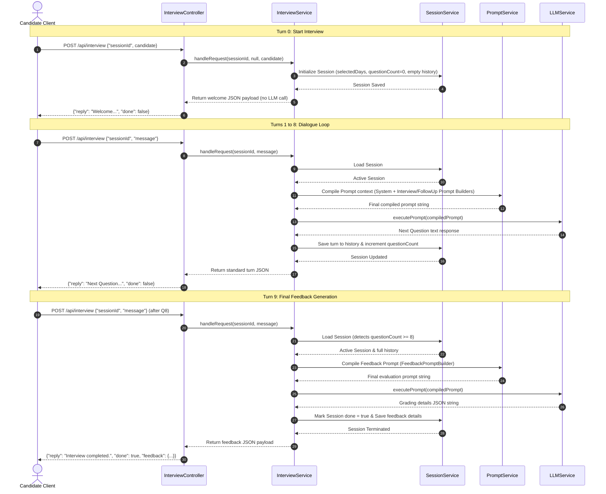
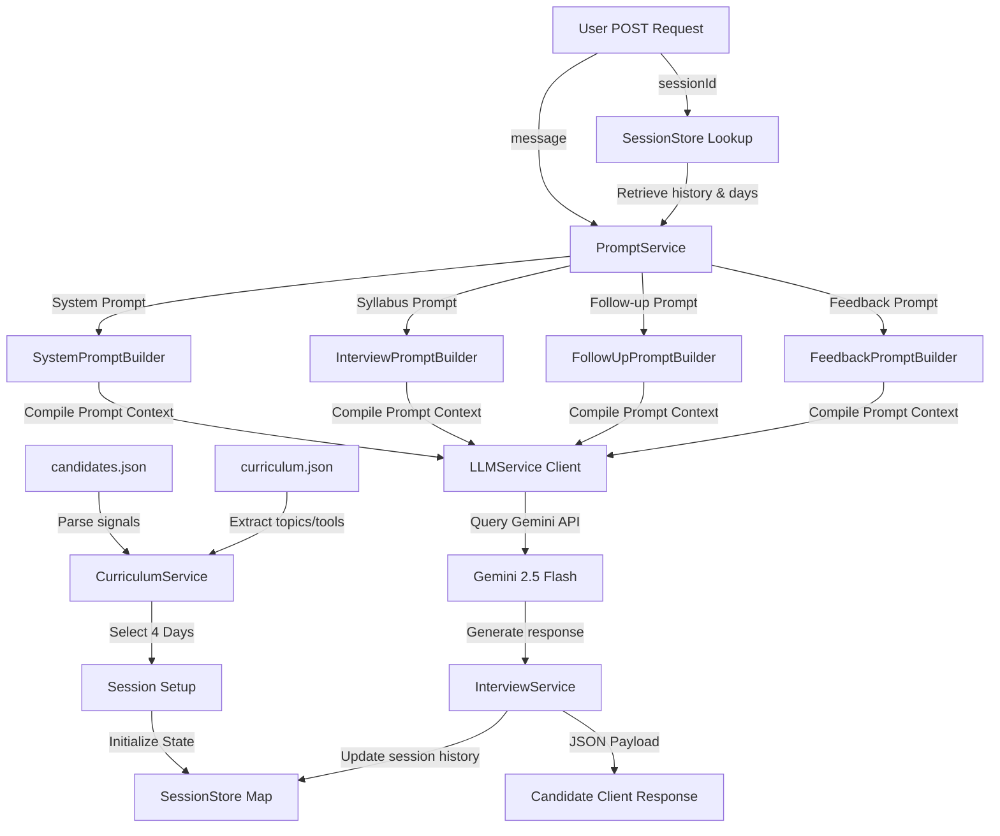

# System Architecture Design

This document details the system design, request flow, session lifecycle, folder layout, and data pipelines for the AI Interview Agent.

---

## 1. Request Flow Sequence Diagram

This diagram shows how different request turns are processed: the initial setup (Turn 0), a conversational loop turn (Turns 1-8), and the final grading turn (Turn 9).



---

## 2. Session State Lifecycle

The diagram below tracks the lifecycle of session states:

```mermaid
stateDiagram-v2
    [*] --> Uninitialized: Application start / user idle
    Uninitialized --> Active_Welcome: POST /api/interview (with candidate object)
    note on left of Active_Welcome
        State:
        - questionCount = 0
        - selectedDays = 4 selected days
        - history = []
    end note
    
    Active_Welcome --> Active_Loop: POST /api/interview (with message / turn 1)
    
    state Active_Loop {
        [*] --> Turn_Process: Retrieve state by sessionId
        Turn_Process --> LLM_Generate: Increment questionCount, call LLMService
        LLM_Generate --> Save_Turn: Save response and questions to history
        Save_Turn --> [*]
    }

    Active_Loop --> Active_Loop: questionCount < 8
    Active_Loop --> Final_Grading: questionCount >= 8 + Candidate answer 8
    
    Final_Grading --> Completed: Call FeedbackService to compile JSON report
    Completed --> [*]: done = true & return feedback details
```

---

## 3. Data Flow Diagram

This diagram shows how synthetic files, user messages, and prompt configurations flow to generate final responses:



---

## 4. Folder Structure & Service Mapping

Our directory layout separates concerns by grouping routing controllers, decoupled services, prompt builder modules, public assets, and test suites:

```
Interview_Agent/
│
├── docs/                             # Engineering specifications & logs
│   ├── PROJECT_MILESTONES.md         # Master milestone roadmap
│   ├── DEVELOPMENT_WORKFLOW.md       # Development phases and DoD guidelines
│   ├── FINAL_ARCHITECTURE_DECISION.md# Frozen architectural details
│   ├── INTERVIEW_ENGINE_DESIGN.md    # Request processing pipeline design
│   ├── SYSTEM_ARCHITECTURE.md        # System flow diagrams (this file)
│   └── AI_ENGINEERING_LOG.md         # Natural-language engineering journal
│
├── PROMPTS/                          # AI collaboration audits
│   ├── PROMPTS.md                    # Prompt log master directory index
│   └── [category_logs].md            # Placeholder prompt history logs
│
├── public/                           # Frontend Assets (Vanilla HTML/CSS/JS)
│   ├── index.html                    # Single Page Layout (Card selector & chat panels)
│   ├── style.css                     # Baseline CSS variables & CSS grid rules
│   └── app.js                        # UI controller and API endpoints caller
│
├── src/                              # Source code root
│   ├── controllers/
│   │   └── InterviewController.js     # HTTP request router handler
│   │
│   ├── services/
│   │   ├── InterviewService.js        # Core interview pipeline coordinator
│   │   ├── SessionService.js          # In-memory session store & timeout cleaner
│   │   ├── CurriculumService.js       # Syllabus parser and dynamic day picker
│   │   ├── LLMService.js              # Gemini SDK wrapper & Mock fallback client
│   │   ├── FeedbackService.js         # Final grading compiler & parser
│   │   └── PromptService.js           # Prompt compiler orchestration service
│   │
│   └── services/promptBuilders/
│       ├── SystemPromptBuilder.js     # Instructions, tone, and guardrail prompts
│       ├── InterviewPromptBuilder.js  # Syllabus daily objectives & tools prompts
│       ├── FollowUpPromptBuilder.js   # Probing and context-based prompt logic
│       └── FeedbackPromptBuilder.js   # Structured feedback evaluation templates
│
├── server.js                         # Root application boot loader
├── test_api.js                       # End-to-end integration test runner
├── .env.example                      # Configuration template
└── .gitignore                        # Git exclusion profiles
```

---
